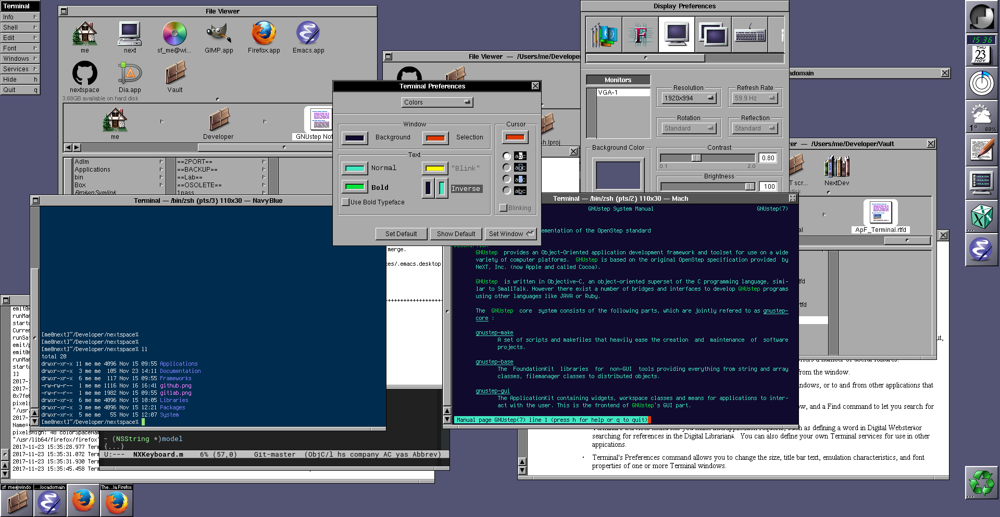
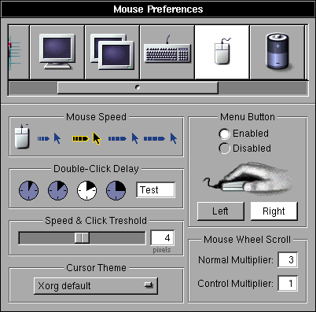
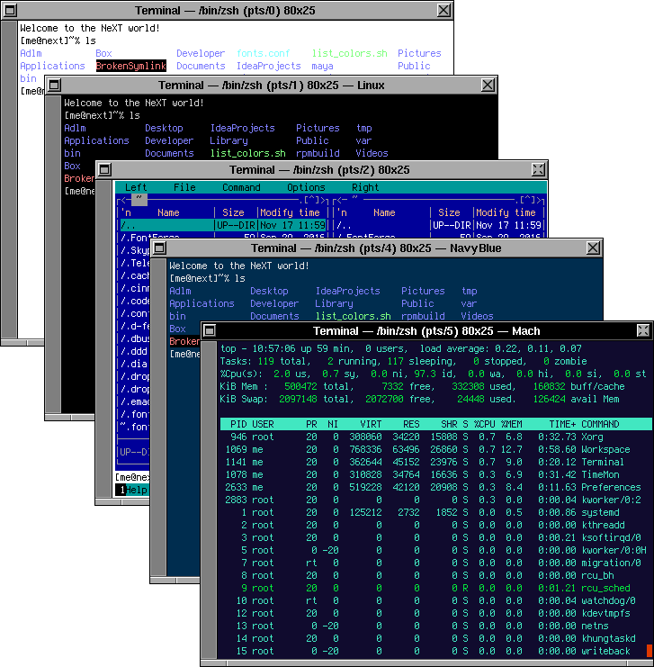

# NEXTSPACE

NEXTSPACE is a desktop environment that brings a [NeXTSTEP](https://en.wikipedia.org/wiki/NeXTSTEP) look and feel to Linux. I try to keep the user experience as close as possible to the original NeXT OS. It is developed according to the ["OpenStep User Interface Guidelines"](http://www.gnustep.org/resources/documentation/OpenStepUserInterfaceGuidelines.pdf).

> An explanation of the NeXTSTEP / NextStep naming convention is discussed in further detail [here](Documentation/OpenStep%20Confusion.md).

I want to create a fast, elegant, reliable, and easy to use desktop environment with maximum attention to user experience (usability) and visual maturity. I would like it to become a platform where applications will be running with a taste of NeXT's OS. Core applications such as Login, Workspace, and Preferences are the base for future application development and examples of style and application integration methods.

NEXTSPACE is not just a set of applications loosely integrated to each other. It is a core OS with frameworks, mouse cursors, fonts, colors, animations, and everything I think will help users to be effective and happy.

## Why?
1. I like the look, feel, and design principles of NeXTSTEP.
2. I think [GNUstep](http://www.gnustep.org) needs a reference implementation of a user-oriented desktop environment.
3. I believe it will become an interesting environment for developers and comfortable (fast, easy to use, feature-rich) for users.

Unlike other 'real' and 'serious' projects, I have not yet defined a target audience for NEXTSPACE. I intentionally left aside modern UI design trends (fancy animations, shadows, gray blurry lines, flat controls, acid colors, transparency). I like the accurate, clear, grayish, and "boring" UI that helps, not hinder, to get my job done.

## Not planned
* Porting to other Linux distributions and operating systems. For now, I want a fast, accurate, and stable version for CentOS 7. However, NEXTSPACE was designed to be portable and thus this point may be changed in future.
* GNOME, KDE, macOS rival in terms of visual effects, modern design principles, look and feel.
* Implementing a macOS-like desktop paradigm. There is another good place for this -- see [Étoilé](http://etoileos.com).

## Installing
Installation is based off CentOS 7's minimal install, you can find [full directions in the installation guide](https://github.com/trunkmaster/nextspace/wiki/Install-Guide). 

## Applications
Below is a brief description of core applications. More information about application functionality will be added in the future.

### Login
[Status of implementation](https://github.com/trunkmaster/nextspace/projects/6)

A simple login panel where you enter your user name and password. No screenshot - it's an exact copy of NeXTSTEP's `loginwindow` in terms of look and feel.

### Workspace
[Status of implementation](https://github.com/trunkmaster/nextspace/projects/4)

A fast and elegant Workspace Manager using multithreading to provide maximum smoothness for:
* File system navigation, file management (create, copy, move, link files/directories).
* Seamless application, process, and window management (start, autostart, close, resize, move, maximize, miniaturize, hide).
* macOS-style window resizing: the cursor stops moving when the maximum/minimum size of a window has been reached, and the cursor changes its image to give a hint for available directions.
* Virtual desktops, Dock, applications and window icons.
* Media management - automatically mounting removable media, providing menu items to eject/mount/unmount removables.
* Background processes - all file and media management operations have status indicators with controls (stop, pause, cancel).
* Launcher - a panel to run commands with autocompletion and history.
* Recycler - support for drag-and-drop and the ability to restore recycled objects to their original location with a single click.
* Other: inspectors for various types of contents, finder, console messages and preferences for various parts of Workspace.

> Note: Workspace is NOT:
> * WindowMaker with some patches
> * WindowMaker with some good configuration defaults only
> * Another implementation of WindowMaker.
> 
> Workspace is written from scratch. Some WindowMaker code is a part of Workspace (as well as configuration defaults) to provide window management functions. The code is tightly coupled with Workspace to provide seamless intergation. Configurable parameters of the integrated WindowMaker are spread across Workspace's Preferences and Preferences application.

Theoretically, Workspace can be used without WindowMaker. However, the current development focus is on a **single** application to deliver the best user experience.

### Preferences
[Status of implementation](https://github.com/trunkmaster/nextspace/projects/2)

Settings for locale, fonts, displays (size, brightness, contrast (gamma correction), desktop background, displays arrangement), keyboard (repeat, layouts, numpad behaviour, modifiers), mouse (delay, threshold, scrollwheel settings, mouse buttons configutation), sound, network, power management.

  
 

### Terminal
[Status of implementation](https://github.com/trunkmaster/nextspace/projects/3)

A terminal with Linux console emulation. I've started with the version created by Alexander Malmberg and made numerous fixes and enhancements. The original application can be found on the [GNUstep Application Project](http://www.nongnu.org/gap/terminal/index.html) site. Enhancements to the original application are numerous. Some of them are as follows:
* Preferences and Services panels rewritten from scratch.
* Numerous fixes and enhancements in: color management (background/foreground elements can be set to any color), cursor placement fixes on scrolling and window resizing, and the addition of 'Clear Buffer' and 'Set Title' menu items.
* Search through the text displayed in the terminal window (Find panel).
* Session management: you can save a window with all its settings that are set in the preferences panel (including any running shells/commands) to a file and then open it. Configuration with multiple windows is supported.

## For developers
For those who are eager to know "How it's done?" can find information on development tasks, goals, solutions, implementation details, and build instructions on the [Wiki](https://github.com/trunkmaster/nextspace/wiki).
